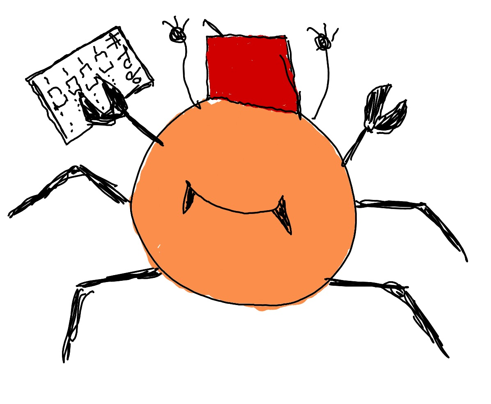

# yarmtl: yet another rust markdown todo-list

## idea
the idea behind the project is to make a tui todo-app based on markdown files that can use nlp input for task input like as a bad alternative to services like todoist.

